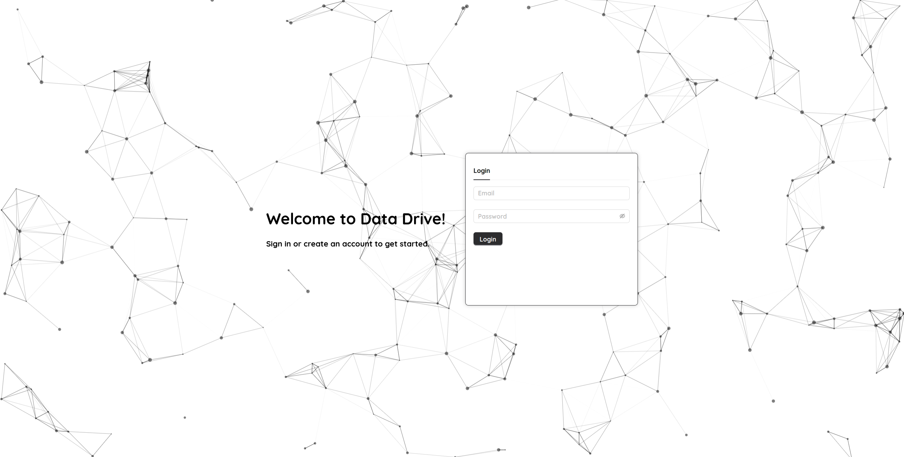
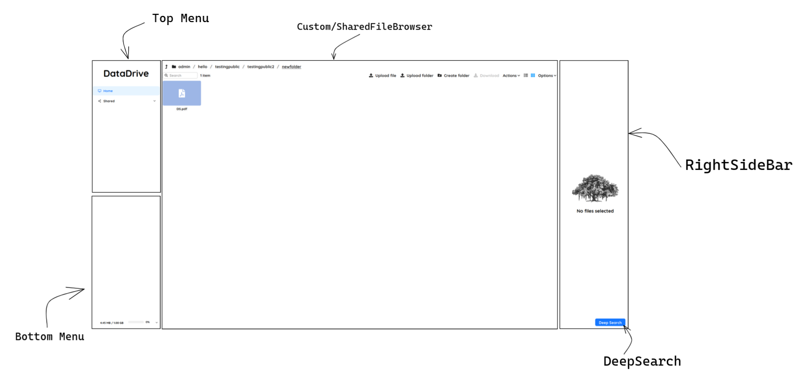

# Frontend Documentation

## Directory Structure
```
.
├── App.js
├── index.css
├── index.js
├── logo.svg
├── Pages
│   ├── components
│   │   ├── AdminPageSidebar.js (shows the config settings)
│   │   ├── AdminTable.js (shows the table allowing you to configure quotas etc.)
│   │   ├── BottomMenu.js 
│   │   ├── CreateFolderModalForm.js (Form inside the modal)
│   │   ├── CreateFolderModal.js (modal which opens up on clicking create folder)
│   │   ├── css
│   │   │   └── components.css (css for all the components)
│   │   ├── CustomFileBrowser.js 
│   │   ├── DeepSearchModal.js 
│   │   ├── FooterBar.js (deprecated)
│   │   ├── Footer.js (deprecated)
│   │   ├── LoginForm.js (Login Page Form)
│   │   ├── Notification.js (handles notifications shown during file sharing)
│   │   ├── PictureCarousel.js (picture carousel shown when clicking on a picture)
│   │   ├── PictureModal.js (modal which opens on clickng pictures, contains carousel)
│   │   ├── RightSidebar.js 
│   │   ├── SharedByTable.js (Table to show files shared by you, can unshare)
│   │   ├── SharedFileBrowser.js 
│   │   ├── shareFolderModal.js (modal which opens on clicking "Share Folder")
│   │   ├── SignupForm.js (deprecated as using Signup)
│   │   ├── TopMenu.js 
│   │   ├── TransferFileModalForm.js (Form inside the TransferModal)
│   │   ├── TransferFileModal.js (modal which opens on clicking "Copy/Move")
│   │   └── VideoModal.js
│   ├── HomePage
│   │   ├── css
│   │   │   └── HomePage.css
│   │   └── HomePage.js (Main HomePage)
│   ├── LoginPage
│   │   ├── css
│   │   │   └── LoginPage.css
│   │   ├── LoginPage.js (Login Page)
│   │   └── particlesConfig.js
│   └── NotFound
│       └── NotFound.js
├── public
│   ├── 404SadFace.png
│   ├── Folder.png
│   └── IIITH.png
└── utils
    ├── adminupdate.js (handles endpoint for updating user quotas etc.)
    ├── api.js (wrapper around axios)
    ├── createFileElement.js (handles endpoint for creating file)
    ├── createFolder.js (handles endpoint for creating folder)
    ├── customFileActions.js (file actions)
    ├── extensions.js (dictionary of extensions)
    ├── fetchAdminData.js (fetch Admin Related data)
    ├── fetchConfig.js (fetch default configs)
    ├── fetchFiles.js (sets the file array)
    ├── fetchSharedByData.js (sets the data which is seen in the Shared By Table)
    ├── fetchSharedFiles.js (sets the shared files array)
    ├── fetchUserInfo.js (sets the user info and path and shared path)
    ├── fileActions.js (handles opening files and folders)
    ├── fileUpload.js (handles the endpoint for uploading files)
    ├── handleActions.js 
    ├── logout.js (handles the endpoint for logging the user out)
    ├── modalutils
    │   ├── copyandmoveutils.js (handles the endpoint for copy and move)
    │   ├── createfolder.js  (handles the endpoint for creating folder)
    │   └── shareutils.js (handles the endpoint for sharing files)
    └── toaster.js
```

## Website Structure

There are essentially 3 main Pages in the website

- **Login Page** : Allows the user to login into the website
- **Home Page** : The main page, which shows the drive, to the left is a menu which consists of two 3 items, which allows the following

    -   Home : allows users to see their files (which they have on the drive)
    -   Shared with me : allows users to see files which other users have shared with them
    -   Shared by me : allows users to observe files which are shared by them, allowing them to unshare these files

    It also has support for logging out, and has support for an admin panel, which allows the admins to configure the storage quotas and permission for every user, in addition to changing the configs for the default storage quota, bandwidth and other such features.

- 404 Not Found : Users will be directed to this website upon an inappropriate request.

## Login Page
The Login Page looks as follows
 

The background is being rendered using a Library called *TSParticles* and the tabs are being rendered through the *Tabs* component provided by *antd*

## Home Page

The HomePage is divided into the following page 
 
 

 - TopMenu : Handles the Menu which shows the different panes, and allows you to switch between the Custom File Browser(visible when you are watching your own files) and the Shared File Browser(visible when you are watching the shared files)
 - BottomMenu : contains a menu which shows a progress bar displaying the amount of space you have left according to your storage, and the options to logout, and switch to the Admin Panel (only works if you are an admin)
 - CustomFileBrowser/SharedFileBrowser : The primary component which shows all your files and folders, and allows you to navigate through your drive. 
 - RightSidebar : The component is essentially a preview pane, which shows the preview of a file, including the thumbnail, the size of the file and the last modified date of the file.
 - DeepSearch : This component opens up a modal which allows you to perform a deep recursive search on your drive, allowing you to access files, which are deeper than the level you are currently at.


### About the FileBrowser 

The FileBrowser is being handled by a component called [chonky](https://chonky.io/) . This handles everything including : 

- Displaying Files and Folders
- Opening Files and Folders in their respective viewers
- Creating Folders
- Uploading Files (Supports uploading multiple files)
- Uploading Folders 
- Downloading Files and Folders (Supports downloading multiple objets, will just zip them together)
- Deleting Files and Folders and much more

In addition to all of this, it also supports showing the directory structure in both the list and grid view, along with support with sorting alphabetically as well. All of these are maintained through FileActions. For further information on file actions, you can refer to the [FileActions](https://chonky.io/docs/2.x/file-actions/basics) section in the chonky website. With regards to the codebase, the fileactions are all created in the file `frontend/src/utils/customFileActions.js`

```js
const deleteFiles = defineFileAction({
  id: "delete_files", // id of the action (will be used in the callback function in HomePage.js)
  requiresSelection: true, // requires you to select the files
  hotkeys: ["delete"], // keyboard shortcut
  button: {
    name: "Delete files", // name of the button
    toolbar: true, // shows up on the toolbar (the top bar beside the folder chain)
    contextMenu: true, // shows up on the context menu (shown when you right click)
    group: "Actions", 
    icon: ChonkyIconName.trash, // icon to be used (here we are using the chonkyIcons Library, can use your own library)
  },
});
```

In order to add your own File Actions, you can just add a similar file action as the one defined above, with your own set of parameters, and export it 

