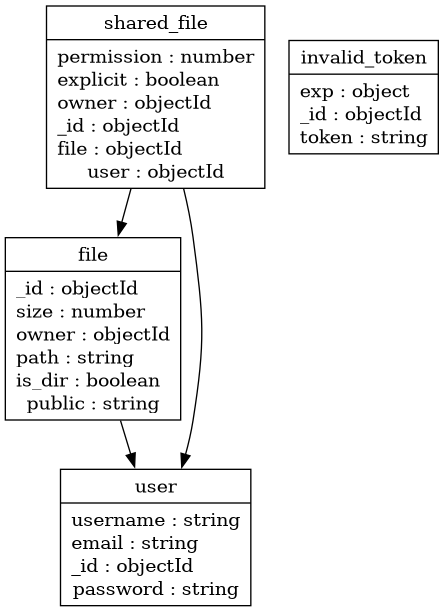
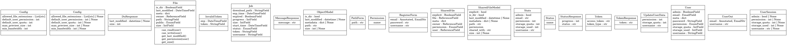

# Project Description

Data Drive is a versatile data management platform that seamlessly integrates with MinIO. It offers an abstraction layer on top of MinIO, enhancing it with additional features while providing an intuitive and user-friendly interface. This combination empowers us to efficiently manage, access, and collaborate on data.

## Architecture
For Backend we use fastapi, which is python based framework with in built data validation using pydantic. Furthermore, 
it also has support for async programming which is used for the download background task. It also supports OpenAPI which
is used for documentation. 

For Frontend we use ReactJS, which is a javascript based framework. It is used for the frontend of the application.

For Database we use two databases, one is MongoDB which is used for storing the metadata of the files, permissions, 
users, etc. The other is MinIO which is used for storing the actual files.

The Database Diagram is as follows:

The Class Diagram is as follows:

## Features
### User
The application supports creating users, logging in and logging out. Authentication is done using JWT tokens and fastapi.
Each user is assigned a storage space that is pre-defined by the admin and can be changed later. The user is also assigned
a permission level which can be changed by the admin. The user can also see the storage space used and their assigned quota.

### Data Management 
* Upload - The user has the ability to upload files to their assigned storage space if they have the permission. This is done using MinIO and MongoDB.
* Download - The user has the ability to download files from any storage space if they have the permission. In this process 
the file is first downloaded from MinIO and then sent to the user. 
* File System manipulation - The user has the ability to create and delete folders given they have the permission. 
* File Sharing - The user has the ability to share files with other users. The user can also set permissions for the shared file. 
* Copying/ Moving files - The user has the ability to copy or move files from one folder to another. 
> While performing the copy or move operation, we have to make sure we appropriately update the shares and permissions of the file.
### Data Visualization
The application supports visualizing selected data formats in the application itself. Some of the supported formats are: Markdown, Images, Video etc.
### Admin Management
The application supports creating admins, logging in and logging out. The admin has the ability to assign permissions to users, change storage space, etc.

